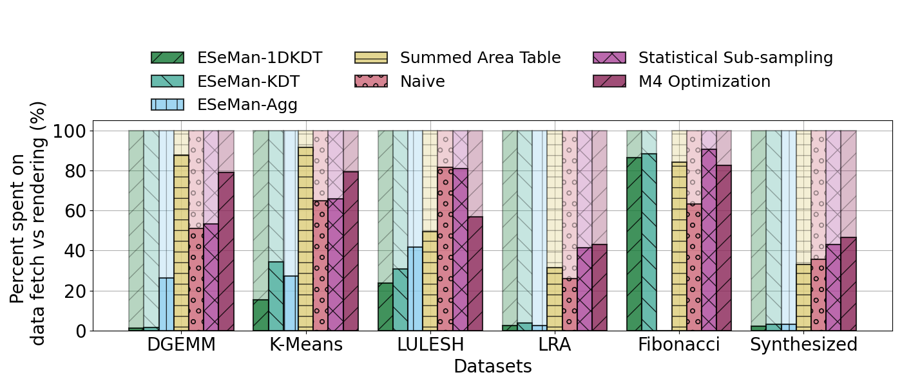

# ESeMan Summary Improvement

*2026-03-03 17:40 UTC*

## User

Refer back to the ESeMan chapter in the results subsection. Provide a better one sentence summary for the following quoted texts "Except for the LULESH dataset, one of the EseMan configurations achieves the lowest rendering time across dataset. For the LULESH dataset, only Naive has the lowest time."

## Assistant

Across all datasets except **LULESH**, at least one ESeMan configuration achieves the lowest rendering time, whereas for **LULESH** the Naive approach remains the fastest.

## User

the caption for this figure goes like the quoted text "Percentage breakdown of total execution time spent on data fetching (dark bars) and chart rendering (light bars) across seven data management configurations for range queries. Except for the LRA and Synthesized dataset, data fetch time dominates execution time for the Non-ESeMan configurations. ESeMan configurations substantially lowers the data fetch percentage."

Now, give me a short description of the chart that I can include on my results subsection.

📎 [window_stacked_chart.png](../files/ESeMan Summary Improvement_69a71cdc/window_stacked_chart.png)

## Assistant

The chart shows that for most datasets, non-ESeMan approaches spend the majority of execution time on data fetching, whereas ESeMan configurations consistently shift the cost toward rendering by substantially reducing fetch overhead. This trend holds across DGEMM, K-Means, LULESH, and Fibonacci, with more balanced behavior observed for LRA and the Synthesized dataset.

## User

make it descriptive and more clear.

## Assistant

Figure X illustrates the percentage breakdown of total execution time between data fetching and chart rendering across datasets and configurations. For most datasets (DGEMM, K-Means, LULESH, and Fibonacci), the non-ESeMan approaches spend a dominant portion of time on data fetching, often exceeding rendering costs. In contrast, all ESeMan configurations consistently reduce the data fetch percentage, shifting the majority of execution time toward rendering. This effect is less pronounced for LRA and the Synthesized dataset, where the fetch and rendering costs are comparatively more balanced.
