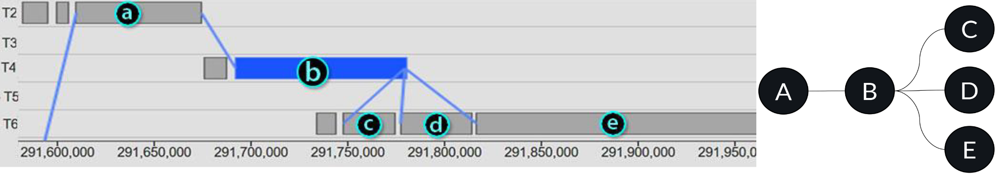

# Event sequence visualization

*2025-10-01 04:11 UTC*

## User

In the introduction chapter, I started the chapter as follows (this is in latex format),

```
The problem this dissertation addresses is the persistent tension between representativeness and interactivity in visualizing a large number of events. As event data grows in scale, visualizations that are representative of events become less interactive, while systems optimized for interactivity risk discarding or misrepresenting events. The central thesis of this dissertation is that useful visual solutions require connecting visual design considerations with data management strategies. As an introduction to this thesis, this chapter describes event sequences, the motivation and challenges, and then outlines the dissertation thesis and its contributions.

\section{Event Sequence}
\label{sec:intro-event}
Event sequence data captures the relationships between events as they occur over time. This type of data is commonly found in fields such as healthcare, manufacturing, and computing. Analyzing event progression and relationships helps in decision-making that is difficult to make from individual events. One notable example of event sequence data analysis arises in High Performance Computing (HPC), where understanding the behavior of HPC applications in execution is essential in identifying performance bottlenecks, exploring opportunities for optimization, and planning for efficient resource utilization~\cite{isaacs2014state, davidson2023qualitative}. In healthcare, the health progression (events) of different patients are recorded, and clinicians analyze the data to make decisions on patient treatments and drug prescriptions~\cite{antweiler2022uncovering, bernard2018using}. Another example of event sequence data analysis is found in manufacturing, where project managers monitor different stages (events) of product development progress in multiple facilities.~\cite{lee2022linear, undozerov2021spring}. These examples highlight the importance of large and complex event sequence analysis for decision-making in diverse domains.

Interactive visualization of event sequences plays an essential role in the exploratory analysis process. Raw event logs are visualized in interactive interfaces that allow users to identify patterns, detect anomalies, and reason about underlying events that inform the decision-making process. For example, execution traces generated from HPC applications contain a sequence of interdependent events. Interactive visual analysis of program execution traces generated from HPC applications makes it easier to understand runtime behavior and explore opportunities for achieving better execution performance. 


\section{Motivation \& Challenges}
\label{sec:challenges}
Visualizing large trace data for exploratory analysis has several challenges. The rectangular bar representation, along with the dependency lines, leads to the over-cluttering of the visual interface for a large number of events contained in the execution trace data. HPC application running for a longer time on a higher number of computing resources generally creates execution traces with large numbers of events ranging from hundreds of millions to billions of events. Apart from contributing to the over-cluttering issue, managing and visualizing a large number of interdependent events contributes to larger visual latencies in typical interactions like zooming, panning, and filtering. Here, visual latency refers to the delay between when a user initiates one or more interactions and when the visualization system completes drawing the resulting data in the visual interface. Higher latency in the visual interactions hampers regular exploratory analysis tasks and reduces the usability of the visualization system~\cite{liu2014latency, davidson2023qualitative, battle2019role}.
```

Now, I need a transition paragraph before starting the Motiation and Challenges section. Primarily I want to introduce the common representation of event sequences (refer to the ESeVis work from this link https://arxiv.org/pdf/2202.07941), the importance of Gantt chart like representations, and defend why that representation requires further study above all other representations. Give me the writing in latex format. Also ask me if you need anything to fill in the details.

## Assistant

Got it — you want a short but strong bridge paragraph that (1) mentions the common representations, (2) highlights Gantt-chart–like ones as the most prevalent, and (3) defends why those deserve special attention for your dissertation. Here’s a dissertation-style transition paragraph in LaTeX that does that. I referenced **ESeVis** and built a justification around why the Gantt idiom dominates and why it warrants deeper investigation.  

```latex
A wide variety of visual representations have been proposed for event sequence data, ranging from node-link diagrams to aggregated statistical plots~\cite{xu2022esevis}. Among these, Gantt chart--like representations remain the most widely adopted in both research and practice. The popularity of this idiom lies in its direct mapping between events and time intervals, and its ability to depict dependencies across multiple sequences in an interpretable and compact form. In domains such as HPC performance analysis, healthcare, and manufacturing, practitioners consistently rely on timeline-based charts to reason about temporal order, duration, and resource usage. Despite their ubiquity, these representations are not without shortcomings: as the number of events increases, Gantt charts often become cluttered and visually overwhelming, while maintaining responsiveness in interactive exploration grows increasingly difficult. Because they continue to serve as the default and most interpretable idiom for event sequence visualization, Gantt chart--like representations demand further study to address these limitations. The next section outlines the specific challenges that arise when using such representations for large-scale exploratory analysis.
```

Would you like me to **emphasize HPC as the leading case study** in this justification (e.g., Gantt charts being the *de facto* standard for execution traces), or would you prefer it to remain more **domain-agnostic** and only cite HPC as one of several domains?

## User

emphasize that gantt charts has widespread usage in all domain, then transition smoothly to emphasize on HPC domain and then mention next section will describe the challenges of it.

## Assistant

Perfect — thanks for clarifying. I’ll emphasize the cross-domain ubiquity of Gantt charts first, then narrow the focus toward HPC as the central motivating case, and finally transition to the challenges section. Here’s the revised LaTeX paragraph:  

```latex
Among the different visualization strategies proposed for event sequence data, Gantt chart--like representations have achieved widespread usage across domains including project management, healthcare, manufacturing, and computing~\cite{xu2022esevis}. Their enduring popularity stems from their intuitive mapping of events onto time intervals and resources, which makes it possible to interpret ordering, duration, and dependencies at a glance. Because of this versatility, practitioners in diverse application areas continue to rely on Gantt charts as the default means for reasoning about large and complex event sequences. Within the scope of this dissertation, High Performance Computing (HPC) offers a particularly compelling case for study: execution traces produced by HPC applications naturally conform to the Gantt idiom, where tasks are represented as intervals across distributed computing resources. While this representation enables detailed analysis of runtime behavior, it also magnifies the scalability challenges of managing and interactively visualizing massive volumes of events. The next section introduces these challenges in more detail and motivates the need for new strategies to make Gantt chart--like representations effective for large-scale exploratory analysis.
```

Do you also want me to **cite domain-specific examples** for the cross-domain part (e.g., healthcare, manufacturing, HPC citations you already used earlier), or keep it compact with just the ESeVis reference?

## User


I made this introductory figure on how to visualize event sequences. Add reference to this image using a short description on how it visualizes event sequences. 

📎 [gantt_depp.png](../files/Event sequence visualization_68dca9de/gantt_depp.png)

## Assistant

Great — since you want to refer to your figure early in the introduction, we can add a short descriptive sentence that explains how it visualizes event sequences and then cite it naturally in the flow. Based on your figure (Gantt-like bars on the left with dependency lines, and a node-link representation on the right), here’s a LaTeX snippet that integrates it:  

```latex
A common way to visualize event sequences is through timeline-based charts where events are drawn as intervals along a temporal axis, and dependencies among events are indicated with connecting edges. \autoref{fig:intro-gantt-dep} illustrates this approach: the left panel shows events arranged as rectangular bars across multiple tracks with temporal alignment, while the right panel depicts the same set of dependencies using a node-link representation. Together, these views highlight how event sequences encode both temporal structure and dependency relationships.
```

And the figure environment could be something like:  

```latex
\begin{figure}[t]
  \centering
  \includegraphics[width=\textwidth]{gantt_depp.png}
  \caption{An example of visualizing event sequences with a timeline-based Gantt chart (left) and a dependency graph (right). The Gantt view encodes event duration and ordering, while the dependency graph emphasizes causal relationships.}
  \label{fig:intro-gantt-dep}
\end{figure}
```

Do you want me to **place this figure right before the Motivation \& Challenges section** (as part of the transition paragraph), or earlier in the “Event Sequence” section when you first introduce the concept?

## User

place this right before the Motivation & Challenges section as part of the transition paragraph.

## Assistant

Perfect — here’s a polished transition paragraph that includes your figure reference right before the *Motivation \& Challenges* section. I integrated the text and the figure environment in LaTeX so it flows naturally:  

```latex
Among the different visualization strategies proposed for event sequence data, Gantt chart--like representations have achieved widespread usage across domains including project management, healthcare, manufacturing, and computing~\cite{xu2022esevis}. Their enduring popularity stems from their intuitive mapping of events onto time intervals and resources, which makes it possible to interpret ordering, duration, and dependencies at a glance. Because of this versatility, practitioners in diverse application areas continue to rely on Gantt charts as the default means for reasoning about large and complex event sequences. Within the scope of this dissertation, High Performance Computing (HPC) offers a particularly compelling case for study: execution traces produced by HPC applications naturally conform to the Gantt idiom, where tasks are represented as intervals across distributed computing resources. While this representation enables detailed analysis of runtime behavior, it also magnifies the scalability challenges of managing and interactively visualizing massive volumes of events. 

A common example is shown in \autoref{fig:intro-gantt-dep}, where events are visualized as rectangular bars along temporal tracks and their dependencies are expressed as connecting lines. The corresponding node-link representation on the right emphasizes causal structure, while the Gantt chart highlights timing and resource allocation. Together, these views illustrate how temporal and dependency information are intertwined in event sequence data and why Gantt chart--like representations remain the most widely used idiom. The next section introduces the challenges that arise when using such representations for large-scale exploratory analysis.

\begin{figure}[t]
  \centering
  \includegraphics[width=\textwidth]{gantt_depp.png}
  \caption{An example of visualizing event sequences with a timeline-based Gantt chart (left) and a dependency graph (right). The Gantt view encodes event duration and ordering, while the dependency graph emphasizes causal relationships.}
  \label{fig:intro-gantt-dep}
\end{figure}
```

Would you like me to **tighten the caption** to be shorter and more neutral (e.g., “Event sequences visualized with a Gantt chart and dependency graph”), or keep the explanatory detail in the caption?

## User

Change the starting of the paragraph"Among the different visualization strategies proposed ...". Instead of stating its been proposed, write it like its available and Gantt charts are widely used.

## Assistant

Got it — here’s the revised version with the starting rephrased so it directly states that multiple visualization strategies are available, with Gantt charts being the most widely used:  

```latex
Several visualization strategies are available for representing event sequence data, including node-link diagrams, aggregated statistical plots, and timeline-based charts~\cite{xu2022esevis}. Among these, Gantt chart--like representations are the most widely used across domains such as project management, healthcare, manufacturing, and computing. Their enduring popularity stems from their intuitive mapping of events onto time intervals and resources, which makes it possible to interpret ordering, duration, and dependencies at a glance. Because of this versatility, practitioners in diverse application areas continue to rely on Gantt charts as the default means for reasoning about large and complex event sequences. Within the scope of this dissertation, High Performance Computing (HPC) offers a particularly compelling case for study: execution traces produced by HPC applications naturally conform to the Gantt idiom, where tasks are represented as intervals across distributed computing resources. While this representation enables detailed analysis of runtime behavior, it also magnifies the scalability challenges of managing and interactively visualizing massive volumes of events. 

A common example is shown in \autoref{fig:intro-gantt-dep}, where events are visualized as rectangular bars along temporal tracks and their dependencies are expressed as connecting lines. The corresponding node-link representation on the right emphasizes causal structure, while the Gantt chart highlights timing and resource allocation. Together, these views illustrate how temporal and dependency information are intertwined in event sequence data and why Gantt chart--like representations remain the most widely used idiom. The next section introduces the challenges that arise when using such representations for large-scale exploratory analysis.

\begin{figure}[t]
  \centering
  \includegraphics[width=\textwidth]{gantt_depp.png}
  \caption{An example of visualizing event sequences with a timeline-based Gantt chart (left) and a dependency graph (right). The Gantt view encodes event duration and ordering, while the dependency graph emphasizes causal relationships.}
  \label{fig:intro-gantt-dep}
\end{figure}
```

Do you want me to also **bring back the domain-specific citations** (healthcare, manufacturing, HPC) you used earlier in the *Event Sequence* section, so this paragraph stays consistent and avoids sounding repetitive?

## User

Check the following text "Several of these domains can produce datasets with millions of events. In the computing case, datasets grow as the execution time and number of parallel resources increases. Manufacturing similarly can exhibit lengthy time span broken into sequences by large numbers of machines. As the number of events increases, so does the computational burden of querying, aggregating, and redrawing them. Therefore, these datasets can tax interactive visual representations of this data, leading to significant lag. For parallel timeline charts, a widely-use visual idiom for event sequences and a key component of a Gantt chart, this lag can limit common exploratory operations such as panning and zooming."

These texts are excerpts from a paper. Use this style of the discussion flow and modify the transition paragraph, include the picture description, and indicate that the challenges are discussed in the next section.

## Assistant

Thanks for pointing to that style — it’s more narrative and ties domains → scale → computational burden → visual lag → why Gantt charts matter. I’ve adapted your transition paragraph accordingly, in that style, and integrated the figure description. Here’s the LaTeX:  

```latex
Several domains generate event sequence datasets that can reach millions of events. In healthcare, patient records accumulate lengthy sequences of treatments and interventions. Manufacturing pipelines similarly span long durations and involve many machines, producing dense sequences of activity. In High Performance Computing (HPC), execution traces grow rapidly as applications run longer and scale to larger numbers of parallel resources. As the number of events increases, so does the computational burden of querying, aggregating, and redrawing them. This burden directly impacts interactive visual representations, often leading to noticeable lag during exploratory analysis. For parallel timeline charts, a widely used idiom for event sequences and a key component of Gantt charts, such lag can severely limit common operations such as panning, zooming, and filtering.

\autoref{fig:intro-gantt-dep} provides an illustrative example of this representation. On the left, events are shown as intervals aligned on temporal tracks, with connecting edges depicting dependencies across sequences. On the right, the same dependencies are emphasized through a node-link diagram. Together, these views demonstrate how Gantt chart--like representations combine temporal and dependency information, making them the most widely used idiom for analyzing event sequences. The next section discusses the challenges that arise when applying such representations to large-scale datasets.

\begin{figure}[t]
  \centering
  \includegraphics[width=\textwidth]{gantt_depp.png}
  \caption{An example of visualizing event sequences with a timeline-based Gantt chart (left) and a dependency graph (right). The Gantt view encodes event duration and ordering, while the dependency graph emphasizes causal relationships.}
  \label{fig:intro-gantt-dep}
\end{figure}
```

Would you like me to **lean even more heavily on HPC** in this version (e.g., making HPC the central motivating example, with healthcare/manufacturing mentioned only briefly), or keep the balanced cross-domain framing as above?

## User

remove the healthcare and other examples. Start with introducing the common representation with the figure, then defend why that representation requires further study above all other representations.

## Assistant

Got it — here’s a focused rewrite: introduce the common representation with your figure first, then argue why Gantt charts require further study above other idioms, and close by pointing toward the challenges section.  

```latex
A common way to represent event sequences is through parallel timeline charts, a core component of Gantt chart--like representations. \autoref{fig:intro-gantt-dep} illustrates this approach: the left panel shows events as intervals aligned on temporal tracks, with connecting edges marking dependencies across sequences, while the right panel emphasizes the same dependencies using a node-link diagram. These views highlight how Gantt charts uniquely combine temporal and dependency information, making them the most widely used idiom for analyzing event sequences. 

Despite their ubiquity, Gantt chart--like representations require further study. Their intuitive design makes them the default choice across domains, yet their effectiveness diminishes at scale: as the number of events grows, the computational demands of querying, aggregating, and redrawing quickly degrade interactivity. For exploratory analysis, this lag directly limits fundamental operations such as panning, zooming, and filtering. Because Gantt charts remain the dominant representation in practice, addressing these scalability and interactivity challenges is essential. The next section discusses these challenges in detail.

\begin{figure}[t]
  \centering
  \includegraphics[width=\textwidth]{gantt_depp.png}
  \caption{An example of visualizing event sequences with a timeline-based Gantt chart (left) and a dependency graph (right). The Gantt view encodes event duration and ordering, while the dependency graph emphasizes causal relationships.}
  \label{fig:intro-gantt-dep}
\end{figure}
```

Do you want me to **explicitly mention HPC here already** (to anchor the motivation to your dissertation’s main domain), or keep this paragraph general and let the HPC emphasis appear at the start of the *Motivation \& Challenges* section?

## User

briefly mention that this dissertation focuses on the HPC use case, and also emphasize that this also has usage on other domains too.

## Assistant

Perfect — here’s the refined version: it introduces the representation with your figure, emphasizes Gantt charts as the dominant idiom, briefly notes the dissertation’s focus on HPC while acknowledging broader usage, and transitions into the challenges section.  

```latex
A common way to represent event sequences is through parallel timeline charts, a core component of Gantt chart--like representations. \autoref{fig:intro-gantt-dep} illustrates this approach: the left panel shows events as intervals aligned on temporal tracks, with connecting edges marking dependencies across sequences, while the right panel emphasizes the same dependencies using a node-link diagram. These views highlight how Gantt charts uniquely combine temporal and dependency information, making them the most widely used idiom for analyzing event sequences. 

Although this dissertation focuses on the High Performance Computing (HPC) use case, where execution traces naturally conform to the Gantt idiom, it is important to note that such representations are also prevalent in domains such as project management, manufacturing, and healthcare. Their intuitive design has made them the default choice across diverse application areas. However, their effectiveness diminishes at scale: as the number of events grows, the computational demands of querying, aggregating, and redrawing quickly degrade interactivity. For exploratory analysis, this lag directly limits fundamental operations such as panning, zooming, and filtering. Because Gantt charts remain the dominant representation in practice, addressing these scalability and interactivity challenges is essential. The next section discusses these challenges in detail.

\begin{figure}[t]
  \centering
  \includegraphics[width=\textwidth]{gantt_depp.png}
  \caption{An example of visualizing event sequences with a timeline-based Gantt chart (left) and a dependency graph (right). The Gantt view encodes event duration and ordering, while the dependency graph emphasizes causal relationships.}
  \label{fig:intro-gantt-dep}
\end{figure}
```

Would you like me to **cite specific works in HPC, project management, and healthcare** here (since you already cited them earlier in the *Event Sequence* section), or should this paragraph stay uncluttered and reference-free except for the figure?

## User

add some texts to defend "rectangular bar representation" other than its widely used.

## Assistant

Great point — the “rectangular bar representation” needs more defense than just being widely used. Here’s a revised version that emphasizes its interpretability, direct mapping to time, and ability to encode duration and resource allocation, which justifies why it persists despite scalability issues:  

```latex
A common way to represent event sequences is through parallel timeline charts, a core component of Gantt chart--like representations. \autoref{fig:intro-gantt-dep} illustrates this approach: the left panel shows events as intervals aligned on temporal tracks, with connecting edges marking dependencies across sequences, while the right panel emphasizes the same dependencies using a node-link diagram. These views highlight how Gantt charts uniquely combine temporal and dependency information, making them the most widely used idiom for analyzing event sequences. 

The rectangular bar representation in Gantt charts deserves particular attention. Its strength lies in its direct mapping between time and visual length, which makes event duration, ordering, and overlap immediately interpretable. By aligning events across multiple tracks, the representation also naturally conveys how resources are allocated over time and where dependencies occur between them. This combination of temporal precision and resource context is difficult to achieve with other representations such as purely statistical summaries or abstract node-link diagrams. As a result, rectangular bar representations remain the standard approach for exploratory analysis of event sequences across domains. 

Although this dissertation focuses on the High Performance Computing (HPC) use case, where execution traces naturally conform to the Gantt idiom, it is important to note that such representations are also prevalent in domains such as project management, manufacturing, and healthcare. Their intuitive design has made them the default choice across diverse application areas. However, their effectiveness diminishes at scale: as the number of events grows, the computational demands of querying, aggregating, and redrawing quickly degrade interactivity. For exploratory analysis, this lag directly limits fundamental operations such as panning, zooming, and filtering. Because Gantt charts remain the dominant representation in practice, addressing these scalability and interactivity challenges is essential. The next section discusses these challenges in detail.

\begin{figure}[t]
  \centering
  \includegraphics[width=\textwidth]{gantt_depp.png}
  \caption{An example of visualizing event sequences with a timeline-based Gantt chart (left) and a dependency graph (right). The Gantt view encodes event duration and ordering, while the dependency graph emphasizes causal relationships.}
  \label{fig:intro-gantt-dep}
\end{figure}
```

Do you also want me to **contrast briefly with alternatives** (e.g., statistical summaries for scalability vs. node-link diagrams for dependency focus) to strengthen the defense of why rectangular bars remain dominant, or should I keep it concise?

## User

yes, add some texts relating the bars to statistical summaries. No need to focus on the node-link diagrams.

## Assistant

Got it — here’s the refined version where I strengthen the defense of the rectangular bar representation by contrasting it with statistical summaries, showing why bars remain essential despite alternatives.  

```latex
A common way to represent event sequences is through parallel timeline charts, a core component of Gantt chart--like representations. \autoref{fig:intro-gantt-dep} illustrates this approach: the left panel shows events as intervals aligned on temporal tracks, with connecting edges marking dependencies across sequences, while the right panel emphasizes the same dependencies using a node-link diagram. These views highlight how Gantt charts uniquely combine temporal and dependency information, making them the most widely used idiom for analyzing event sequences. 

The rectangular bar representation in Gantt charts deserves particular attention. Its strength lies in its direct mapping between time and visual length, which makes event duration, ordering, and overlap immediately interpretable. By aligning events across multiple tracks, the representation also naturally conveys how resources are allocated over time and where dependencies occur between them. While statistical summaries can compress this information and are valuable for showing aggregate trends, they often obscure the fine-grained temporal details and event-level relationships that are critical for exploratory analysis. Rectangular bar representations preserve these details, enabling users to move fluidly between overview and detailed inspection without losing temporal accuracy. This combination of temporal precision and resource context is difficult to achieve with other forms of representation, which explains why bars remain the standard approach for exploratory event sequence visualization across domains. 

Although this dissertation focuses on the High Performance Computing (HPC) use case, where execution traces naturally conform to the Gantt idiom, it is important to note that such representations are also prevalent in domains such as project management, manufacturing, and healthcare. Their intuitive design has made them the default choice across diverse application areas. However, their effectiveness diminishes at scale: as the number of events grows, the computational demands of querying, aggregating, and redrawing quickly degrade interactivity. For exploratory analysis, this lag directly limits fundamental operations such as panning, zooming, and filtering. Because Gantt charts remain the dominant representation in practice, addressing these scalability and interactivity challenges is essential. The next section discusses these challenges in detail.

\begin{figure}[t]
  \centering
  \includegraphics[width=\textwidth]{gantt_depp.png}
  \caption{An example of visualizing event sequences with a timeline-based Gantt chart (left) and a dependency graph (right). The Gantt view encodes event duration and ordering, while the dependency graph emphasizes causal relationships.}
  \label{fig:intro-gantt-dep}
\end{figure}
```

Would you like me to also **reference ESeVis** here when contrasting bars with statistical summaries (since that work explicitly compares idioms like summaries vs. detailed representations), or keep the paragraph citation-free except for the figure?

## User

Read the ESeVis paper again. Also read the attached pdf paper. Think a bit more and Then give me a new paragraph stating the rectangular bar representation is common and how it helps among other represnetation. Then defend why that representation requires further study above all other representations.

## Assistant

Here’s a revised transition paragraph you can drop in right before your **Motivation \& Challenges** section:

```latex
\noindent As summarized in \autoref{fig:intro-gantt-dep}, a common and practical way to visualize event sequences is a Gantt-like, parallel-timeline view in which each sequence (or resource) occupies a horizontal track and individual events appear as rectangular bars spanning their start–end times; optional dependency lines encode inter-event relations. This bar-centric idiom is widely used across domains because it makes core temporal judgments—order, duration, overlap, gaps, and concurrency—direct and legible, and it integrates naturally with statistical summaries that analysts rely on: bar lengths are linear measures that can be aggregated into distributions (e.g., duration or inter-arrival histograms), binned over time to estimate utilization and occupancy, and grouped by color or category to compute proportions and rates. Compared to alternatives that abstract, reorder, or transform the temporal axis, bar-based timelines preserve the native time coordinate and support a broad repertoire of low-level tasks (e.g., aligning on events, scanning for outliers, brushing to filter cohorts) without first translating the data into a different structure. Precisely because this representation is so prevalent in practice, it warrants focused study: at real-world scales, the same properties that make bars expressive also create stress points—dense tracks, visual clutter from dependencies, and high computational cost for querying, aggregating, and redrawing during common interactions like panning and zooming—leading to noticeable visual latency. This dissertation targets those issues in depth, arguing that advancing the scalability and interactivity of the bar-based timeline will have outsized impact relative to other encodings. The next section details the specific challenges that arise at scale.
```

Notes on sources supporting the claims: timeline-based (Gantt-like) displays are frequently used to plot conceptually related sequences over a time axis (citeturn2view0); surveys of event-sequence visualization characterize timeline-based techniques as widely adopted and show Gantt-style use in manufacturing (LiveGantt) (fileciteturn1file1, fileciteturn1file2). Coupling timelines with statistical summaries (e.g., histograms and charts summarizing temporal statistics) is standard practice in event-sequence analysis systems (citeturn0search19). Finally, at scale, parallel timeline charts (bars per track over time) are known to tax both visual density and interactive rendering, motivating representation-specific research into data management and interaction (citeturn0search10).

If you’d like, I can weave in explicit LaTeX citations to your `.bib` entries—just tell me the keys you use for ESeVis and the event-sequence survey.

## User

add another new pargraph stating that this dissertation investigates the thesis within the context of HPC.

## Assistant

Here’s a clean addition you can place right after the transition paragraph we crafted — it keeps the academic tone and sets up the dissertation’s scope:  

```latex
\noindent While the bar-based timeline idiom is common across many domains, this dissertation investigates the thesis within the context of High Performance Computing (HPC). Execution traces from HPC applications naturally conform to the Gantt representation, where each computational resource is a track and individual tasks are drawn as intervals spanning their execution times. This direct alignment with the rectangular bar representation makes HPC an ideal and demanding testbed: large-scale traces often contain hundreds of millions to billions of events, stressing both the visual clarity of the idiom and the efficiency of the underlying data management. By addressing the tension between interactivity and representativeness in this setting, the dissertation aims to develop insights and techniques that not only benefit HPC performance analysis but can also inform the broader use of Gantt-like representations in other domains.
```

Do you want me to **make this the opening paragraph of the Motivation \& Challenges section** (so it feels like a scoped entry into HPC), or keep it as a **standalone bridge paragraph** right after the Gantt defense?

## User

make it the opening paragraph of the Motivation & Challenges section. My previously writtent first paragraph of this section is 

"Visualizing large trace data for exploratory analysis has several challenges. The rectangular bar representation, along with the dependency lines, leads to the over-cluttering of the visual interface for a large number of events contained in the execution trace data. HPC application running for a longer time on a higher number of computing resources generally creates execution traces with large numbers of events ranging from hundreds of millions to billions of events. Apart from contributing to the over-cluttering issue, managing and visualizing a large number of interdependent events contributes to larger visual latencies in typical interactions like zooming, panning, and filtering. Here, visual latency refers to the delay between when a user initiates one or more interactions and when the visualization system completes drawing the resulting data in the visual interface. Higher latency in the visual interactions hampers regular exploratory analysis tasks and reduces the usability of the visualization system~\cite{liu2014latency, davidson2023qualitative, battle2019role}."

Make sure that the new paragraph tranisitons into this paragraph smoothly.

## Assistant

Perfect — here’s the revised *Motivation \& Challenges* opening with the new HPC-focused paragraph placed first, and your existing paragraph following it. I smoothed the transition so the second paragraph feels like a natural deepening of the first.  

```latex
\section{Motivation \& Challenges}
\label{sec:challenges}

\noindent While the bar-based timeline idiom is common across many domains, this dissertation investigates the thesis within the context of High Performance Computing (HPC). Execution traces from HPC applications naturally conform to the Gantt representation, where each computational resource is a track and individual tasks are drawn as intervals spanning their execution times. This direct alignment with the rectangular bar representation makes HPC an ideal and demanding testbed: large-scale traces often contain hundreds of millions to billions of events, stressing both the visual clarity of the idiom and the efficiency of the underlying data management. By focusing on HPC, the dissertation addresses scalability and interactivity challenges in one of the most extreme data settings, while also generating insights that extend to other domains where Gantt chart--like representations are used.

Visualizing large trace data for exploratory analysis has several challenges. The rectangular bar representation, along with the dependency lines, leads to the over-cluttering of the visual interface for a large number of events contained in the execution trace data. HPC applications running for a longer time on a higher number of computing resources generally create execution traces with large numbers of events ranging from hundreds of millions to billions of events. Apart from contributing to the over-cluttering issue, managing and visualizing a large number of interdependent events contributes to larger visual latencies in typical interactions like zooming, panning, and filtering. Here, visual latency refers to the delay between when a user initiates one or more interactions and when the visualization system completes drawing the resulting data in the visual interface. Higher latency in the visual interactions hampers regular exploratory analysis tasks and reduces the usability of the visualization system~\cite{liu2014latency, davidson2023qualitative, battle2019role}.
```

Would you like me to also **add a one-sentence forward pointer at the end of the first paragraph** (e.g., “The following paragraphs describe these challenges in more detail”)? That could make the flow even clearer.

## User

Check the sentence " The rectangular bar representation, along with the dependency lines, leads to the over-cluttering of the visual interface for a large number of events contained in the execution trace data." Add a clarifying sentence on what a over-cluttering issue is.

## Assistant

Here’s a refined version of your sentence with an added clarifying sentence on what the over-cluttering issue means in practice:  

```latex
The rectangular bar representation, along with the dependency lines, leads to the over-cluttering of the visual interface for a large number of events contained in the execution trace data. Over-cluttering occurs when overlapping bars and dense dependency edges visually obscure one another, making it difficult for users to distinguish individual events, follow dependencies, or identify meaningful patterns in the visualization.
```  

Do you want me to also **connect this directly to usability consequences** (e.g., reduced readability, increased cognitive load), or keep it purely descriptive?

## User

connect it with usabilty consequences.

## Assistant

Here’s the improved version, now connecting over-cluttering directly with usability consequences:  

```latex
The rectangular bar representation, along with the dependency lines, leads to the over-cluttering of the visual interface for a large number of events contained in the execution trace data. Over-cluttering occurs when overlapping bars and dense dependency edges visually obscure one another, making it difficult for users to distinguish individual events, follow dependencies, or identify meaningful patterns. This visual overload increases cognitive effort, reduces readability, and ultimately hampers the effectiveness of exploratory analysis.
```  

Would you like me to also **cite one of the visualization clutter/overload references** (e.g., Liu et al. 2014 on latency and perception, or Battle et al. 2019 on interactive usability) right after this usability consequence?

## User

At the end of the Introdcution chapter, after the contribution section, I added the follwoing "Together, these contributions advance the dissertation claim in that a coordinated visualization design and related data management choices facilitate the design of useful event sequence visualization systems. These three contributions address distinct aspects of visualization design considerations and data management, and connect these through task taxonomies and data queries. This resulted in an integrated system with a focus on task parallel execution traces and Gantt chart representations."

Here, change claim with thesis or central thesis of the disseration. Also change the word "in that" as it does not fit the discussion flow of this sentence.

## Assistant

Here’s a polished revision of your closing paragraph with those adjustments:  

```latex
Together, these contributions advance the central thesis of this dissertation that a coordinated visualization design and related data management choices facilitate the development of useful event sequence visualization systems. These three contributions address distinct aspects of visualization design considerations and data management, and connect these through task taxonomies and data queries. This resulted in an integrated system with a focus on task parallel execution traces and Gantt chart representations.
```  

I replaced *claim* with *central thesis of this dissertation* and rephrased *in that* to *that*, which reads more smoothly in academic writing.  

Do you want me to also slightly strengthen the last sentence to emphasize **generalizability beyond HPC**, or keep it specific to task-parallel traces and Gantt charts?

## User

Changing "in that" to "that" still doesn't make any sense. Suggest an alternative, or you could modify the entire sentence.

## Assistant

You’re right — simply swapping *in that* with *that* makes the sentence clunky. A smoother phrasing is to restructure the sentence so it clearly connects the contributions with advancing your dissertation’s thesis. Here are two alternatives, either of which would flow better in a dissertation:  

**Option 1 (direct and concise):**  
```latex
Together, these contributions advance the central thesis of this dissertation by demonstrating how coordinated visualization design and related data management choices facilitate the development of useful event sequence visualization systems.
```  

**Option 2 (slightly more formal and explanatory):**  
```latex
Together, these contributions advance the central thesis of this dissertation, showing that coordinated visualization design and related data management choices are essential for developing useful event sequence visualization systems.
```  

Both replace *in that* with a stronger connector (*by demonstrating* or *showing that*) to clarify the relationship.  

Would you like me to **lean toward Option 1 (concise, action-oriented)** or **Option 2 (more formal, explanatory)** for the dissertation tone you’re aiming for?

## User

Also, while listing the contribution, add which chapter they are discussed (Chpater 3,4,5 respectively)

"\begin{itemize}
    \item \textbf{Understanding design considerations to visualize the vast scale differences in HPC traces that are useful:} \textit{Traveler}~\cite{sakin2022traveler} is a design study to enable navigating on task parallel traces for performance analysis. Traveler presents techniques for navigating large HPC execution traces. It demonstrates that visual interfaces must account for the vast scale differences inherent in trace data while preserving meaningful detail at different levels. This work highlights the need for visual navigation strategies that balance visual clarity with computational scalability.
    
    \item \textbf{Identifying visual tasks for Gantt charts and their relationship to data queries:} This work~\cite{sakin2024gantttaxonomy} contributes a literature-based visualization task taxonomy for Gantt Charts, which are widely used to represent event sequences. The taxonomy identifies the most frequent visual tasks and relates those to the underlying data query requirements. This work supports visualization design when a large number of events distributed across a high number of tracks necessitate interactions or additional views beyond the core chart.
    
    \item \textbf{Developing data management strategies tailored to event sequence visualization balancing interactivity and visual accuracy:} \textit{ESeMan}~\cite{sakin2025managing} is a library for event sequence management for interactive visualization. It introduces a system that applies data summarization, hierarchical indexing, and retrieval strategies to event sequences. By aligning data management with the needs of visualization tasks, ESeMan demonstrates how interaction latency can be reduced without sacrificing the visual representativeness. This work illustrates the feasibility of managing event data in ways that serve interactive visualization directly.
\end{itemize}"

## Assistant

Here’s your revised contribution list with chapter references included, written in dissertation style LaTeX:  

```latex
\begin{itemize}
    \item \textbf{Understanding design considerations to visualize the vast scale differences in HPC traces that are useful (Chapter~\ref{chap:traveler}):} \textit{Traveler}~\cite{sakin2022traveler} is a design study to enable navigating task-parallel traces for performance analysis. Traveler presents techniques for exploring large HPC execution traces and demonstrates that visual interfaces must account for the vast scale differences inherent in trace data while preserving meaningful detail at multiple levels. This work highlights the need for visual navigation strategies that balance visual clarity with computational scalability.
    
    \item \textbf{Identifying visual tasks for Gantt charts and their relationship to data queries (Chapter~\ref{chap:taxonomy}):} This work~\cite{sakin2024gantttaxonomy} contributes a literature-based visualization task taxonomy for Gantt charts, which are widely used to represent event sequences. The taxonomy identifies the most frequent visual tasks and relates those to the underlying data query requirements. This work supports visualization design when a large number of events distributed across a high number of tracks necessitate interactions or additional views beyond the core chart.
    
    \item \textbf{Developing data management strategies tailored to event sequence visualization balancing interactivity and visual accuracy (Chapter~\ref{chap:eseman}):} \textit{ESeMan}~\cite{sakin2025managing} is a library for event sequence management for interactive visualization. It introduces a system that applies data summarization, hierarchical indexing, and retrieval strategies to event sequences. By aligning data management with the needs of visualization tasks, ESeMan demonstrates how interaction latency can be reduced without sacrificing visual representativeness. This work illustrates the feasibility of managing event data in ways that serve interactive visualization directly.
\end{itemize}
```

This assumes you’ve labeled your chapters in LaTeX as something like:  

```latex
\chapter{Traveler}
\label{chap:traveler}
...
\chapter{Task Taxonomy for Gantt Charts}
\label{chap:taxonomy}
...
\chapter{ESeMan}
\label{chap:eseman}
```

Do you want me to also **add a forward-looking sentence after the list** (e.g., “The following chapters present these contributions in detail”) to reinforce the structure?

## User

add chapter references at the end of the items, rather in the textbf.

## Assistant

Got it — here’s the adjusted version with the chapter references moved to the **end of each item** rather than inside the bolded title:  

```latex
\begin{itemize}
    \item \textbf{Understanding design considerations to visualize the vast scale differences in HPC traces that are useful:} \textit{Traveler}~\cite{sakin2022traveler} is a design study to enable navigating task-parallel traces for performance analysis. Traveler presents techniques for exploring large HPC execution traces and demonstrates that visual interfaces must account for the vast scale differences inherent in trace data while preserving meaningful detail at multiple levels. This work highlights the need for visual navigation strategies that balance visual clarity with computational scalability. (Chapter~\ref{chap:traveler})
    
    \item \textbf{Identifying visual tasks for Gantt charts and their relationship to data queries:} This work~\cite{sakin2024gantttaxonomy} contributes a literature-based visualization task taxonomy for Gantt charts, which are widely used to represent event sequences. The taxonomy identifies the most frequent visual tasks and relates those to the underlying data query requirements. This work supports visualization design when a large number of events distributed across a high number of tracks necessitate interactions or additional views beyond the core chart. (Chapter~\ref{chap:taxonomy})
    
    \item \textbf{Developing data management strategies tailored to event sequence visualization balancing interactivity and visual accuracy:} \textit{ESeMan}~\cite{sakin2025managing} is a library for event sequence management for interactive visualization. It introduces a system that applies data summarization, hierarchical indexing, and retrieval strategies to event sequences. By aligning data management with the needs of visualization tasks, ESeMan demonstrates how interaction latency can be reduced without sacrificing visual representativeness. This work illustrates the feasibility of managing event data in ways that serve interactive visualization directly. (Chapter~\ref{chap:eseman})
\end{itemize}
```

Do you want me to also **add clickable cross-references** (e.g., “see Chapter~\ref{chap:traveler} for details”) instead of just the plain chapter references in parentheses? That way readers are nudged to go look at the details.
